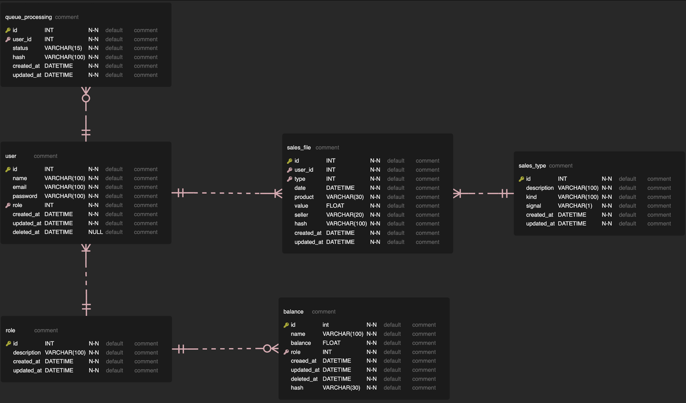

# affiliators project

This repository is separated into 2 projects, a backend project in GoLang and a backend project using React + Typescript. Below will be presented how to run both projects.


## Backend

The project consists of an upload application for creators and affiliates, this approach consists of a dashboard that will allow the user to upload a certain structured file and check how much each user has made in sales and their respective receipts, both on the side of the producer and the affiliate. This application also has authentication schemes and user CRUD, allowing a new user to be created to perform such registration. A producer-consumer scheme was created to allow all uploaded files to be processed as the application has processing availability.

## Install and running

Download the project and with golang installed and configured on the machine, run `go mod tidy` to install the dependencies, then run a make up (if you have the makefile installed) and wait for the docker-compose containers to be installed . If you don't have the makefile installed on your machine, run `docker-compose up -d` and wait.

Inside the repository run the command `go install -tags 'postgres' github.com/golang-migrate/migrate/v4/cmd/migrate@latest` so that the migrate lib is installed.

after this process, run the application with `go run main.go`

### Environment variables

If any internal ip's of the containers are needed, type `docker ps` and with the container's id run `docker inspect <id>`, inside the "Networks" item there will be an "IPAddress" with the information.

The other cases can be seen inside `.env-example`

### Makefile

Sure, here are the descriptions for these commands:

- `make build` will compile the Go project and create an executable hubla-api.
- `make test` will run all tests in the project.
- `make clean` will clean up compiled files from the project.
- `make run` will compile and run the application.
- `make up` will start up all services defined in the Docker Compose file.
- `make down` will stop and remove the containers defined in the Docker Compose file.
- `make migration-up` will start up all tables defined in the Docker Compose file.
- `make migration-down` will stop and remove the tables defined in the Docker Compose file.

### Migrations

The database access credentials for local access are defined inside the Makefile in the following variables. If it is necessary to modify these variables, make the changes inside the file.

```bash
DB_HOST=localhost
DB_PORT=5432
DB_NAME=hubla
MIGRATIONS_PATH=database/migrations
```

All application migrations are contained in database/migrations and should be executed using the `make migrate-up` and `make migrate-down` commands.

### Database modeling

Below follows the model used for the implementation and structuring of the application and the database.



## Frontend

Aligned with the previously described backend project, this project consists of screens for user registration, login and file loading/display. With regard to loading files, the user will select the file or drag such file to a drag-in-drop and the file will be inserted in the processing queue, after this file is processed, the frontend through pooling will load the processed information and stop such pooling, allowing the information to be displayed on the screen.

In the frontend application, you will need to have node installed and run `npm install` if you are using npm or `yarn` or `yarn install` if you are using yarn. After installing all dependencies run a `yarn start`.

## Project improvement points

- Improvement in docker-compose allowing it to be possible to get the IP's dynamically from the loaded containers (backend)
- Implementation of integration tests (backend)
- Verify the need to use cache (memcached or redis) to improve database load time (backend)
- Implementation of E2E tests (frontend)
- Improved listing layout (frontend)
- Add service concepts to some missing components (frontend)
